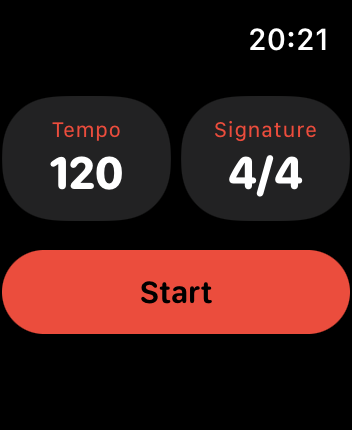

# Click

  

A simple metronome app for Apple Watch.

## Why have I created this app?
When I was recording some stuff on my upright piano with a mic I had major inconvenience because I had to wear headphones to hear the metronome click but the wire was rather short. And obviously if you use computer speakers for click the mic will catch it too. Thus I decided to implement a metronome based on haptic.

## How to use it?
Run the app. Perhaps it will ask for permission to read and store HealthKit data. It's OK. This is needed for the app to work in the background. When you run the metronome it will start a workout (Pesky watchOS restrictions).

## Disclaimer
The app was made on SwiftUI (I don't really like it and understand but Apple decided to deprecate storyboards and all the stuff for watchOS so I had no choice). The quality of app is not so good at this moment. Just prototyping and getting familiar with SwiftUI.